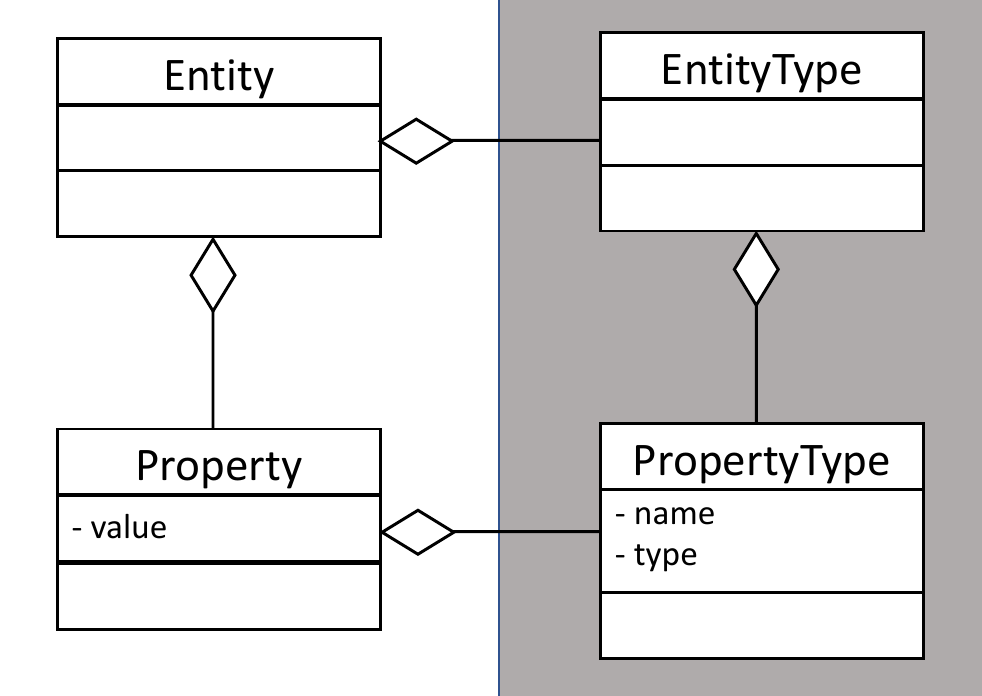

# Adaptive Object Modeling in TypeScript

This web app uses the adaptive object modeling (AOM) design pattern to dynamically create input forms based on the created entities.
The entities and their properties are not hardcoded, achieving a very high degree of flexibility.

## AOM

AOM introduces a runtime type-system that allows the dynamic creation and manipulation of entity properties.

An entity is made of an entity type and properties.
Each property has a property type, which depends on the type of the entity.